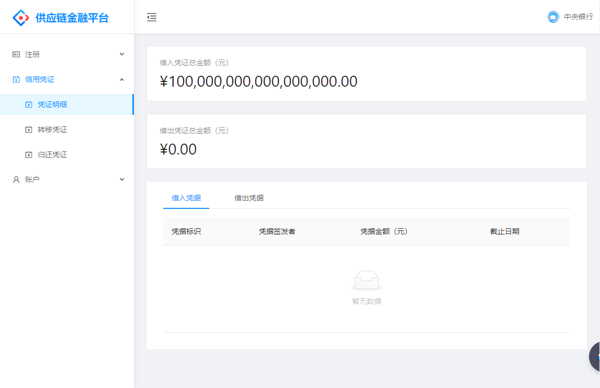
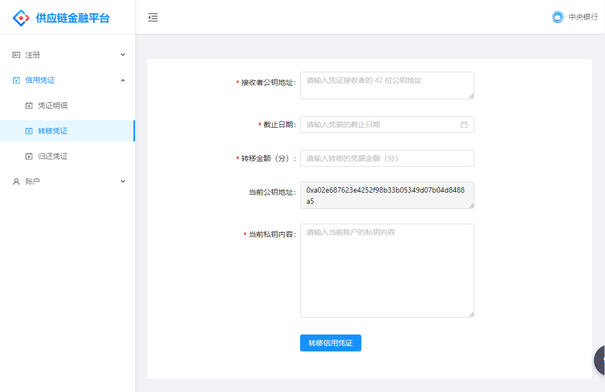

# 供应链金融平台

> 16305204 郑佳豪

GitHub: [Jiahonzheng](https://github.com/Jiahonzheng)

项目地址：[github.com/Jiahonzheng/Blockchain](https://github.com/Jiahonzheng/Blockchain/tree/master/Supplier-Financing)

---

## 信用凭证

信用凭证，即**企业间签发的应收账款单据**，由**债务人**向**债权人**签发，其**流动方向与法币方向相反**。

- 债务人 A 向债权人 B 申请贷款，A 需要签发信用凭证给 B
- 债务人 A 向债权人 B 支付法币欠款，B 需要向 A 返还相应的信用凭证

---

## 存储设计

在合约设计中，我们使用 FISCO BCOS 的 [CRUD](https://fisco-bcos-documentation.readthedocs.io/zh_CN/latest/docs/manual/smart_contract.html#crud) 服务构建智能合约的存储，实现数据和合约的分离。在实现中，我们有两种类型的表：**账户表**和**交易表**。

在实现中，我们将用户划分为 3 种角色：**中央银行**、**普通银行**、**公司**。

- 中央银行：全局唯一，在部署合约时传入至合约中，可实现普通银行的注册
- 普通银行：由中央银行注册，其可实现公司的注册
- 公司

---

## 核心功能

在智能合约[代码](https://github.com/Jiahonzheng/Blockchain/tree/master/Supplier-Financing/contracts)中，我们实现了以下四个核心功能。

- 合约创建
- 银行注册
- 转移凭证
- 归还凭证

---

### 转移凭证

业务场景如下：

- debtor 银行向 debtee 公司提供信用凭证，例如 Bank 给 Car 提供了 1000 万的信用凭证
- debtor 公司向 debtee 公司转移信用凭证，例如 Car 转移 500 万信用凭证给 Wheel
- debtor 公司向 debtee 银行借款，例如 Car 转移 200 万信用凭证给 Bank ，表示申请获得 200 万的融资贷款

---

### 归还凭证

业务场景如下：

- debtee 公司向 debtor 公司返还信用凭证，例如当 Car 向 Wheel 支付 500 万的货款时，Wheel 需要向 Car 返还 500 万信用凭证
- debtee 银行向 debtor 公司返还信用凭证，例如当 Wheel 偿还 Bank 的 200 万贷款时，Bank 需要向 Wheel 返还 200 万信用凭证
- debtee 公司向 debtor 银行返还信用凭证，例如当 Car 完成所有的交易时，需要向 Bank 偿还 1000 万，同时 Bank 需要返回 1000 万信用凭证给 Car

---

## 代码实现

### 服务端

- 基于 [NestJS](https://nestjs.com) 框架构建
- 对接链端：**PML 大法好!**

### 客户端

- 基于 [UmiJS](https://umijs.org) 框架构建，实现**页面多角色鉴权**

---

### 对接链端

> packages/api/web3j/web3jService.js

---

### 对接链端

> packages/api/web3j/web3jService.js

---

## 界面演示

[页面效果演示视频](./assets/demo.mp4)

---

### 登录页面

---

### 银行注册页面

---

### 公司注册页面

---

### 账户信息页面

---

### 账户公示页面

---

### 凭证明细页面

---

### 转移凭证页面

---

### 归还凭证页面

---

## 谢谢大家

项目地址：[github.com/Jiahonzheng/Blockchain](https://github.com/Jiahonzheng/Blockchain/tree/master/Supplier-Financing)
